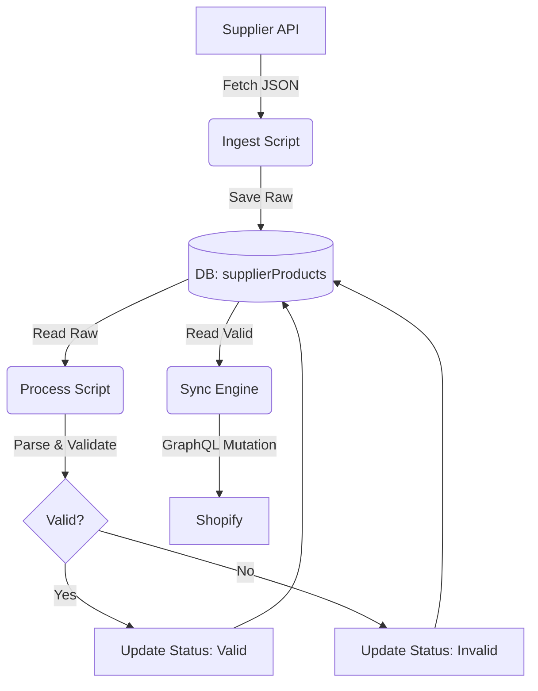

# 04 - Data Flows & Architecture Diagrams

## 📋 İçindekiler

1. [Pipeline Architecture (Ingest -> Process -> Sync)](#pipeline-architecture)
2. [Reprocess Flow](#reprocess-flow)
3. [Shopify Sync Flow (Live)](#shopify-sync-flow-live)
4. [Admin Dashboard Interaction](#admin-dashboard-interaction)

---

## Pipeline Architecture

Bu proje **"Ingest-First"** (Önce Kaydet) mimarisini kullanır. Bu, veri kaybını önler ve hata ayıklamayı kolaylaştırır.



### 1. Ingest Phase
- **Amaç:** Tedarikçiden veriyi en hızlı şekilde alıp güvenli bir yere (DB) koymak.
- **İşlem:** API'den çek -> `raw_api_data` kolonuna yaz -> `validation_status` = 'raw'.
- **Avantaj:** İnternet kopsa bile veri bizde.

### 2. Process Phase
- **Amaç:** Ham veriyi anlamlı hale getirmek.
- **İşlem:**
  1. `raw_api_data`'yı oku.
  2. `TitleParserService` ile başlığı ayrıştır (Width, Ratio, Diameter...).
  3. `PricingRulesService` ile satış fiyatını hesapla.
  4. Zorunlu alanları kontrol et.
  5. Sonucu `metafields` kolonuna yaz ve statüyü güncelle (`valid` veya `invalid`).

### 3. Sync Phase
- **Amaç:** Sadece hazır veriyi Shopify'a göndermek.
- **İşlem:**
  1. DB'den `valid` veya `needs_update` olanları çek.
  2. Shopify'a gönder (Create/Update).
  3. Sonucu DB'ye işle (`shopify_product_id`, `last_synced_at`).

---

## Reprocess Flow

Parser mantığı değiştiğinde veya yeni kurallar eklendiğinde kullanılır.

```
USER (Dashboard) -> Click "Verileri Yeniden İşle"
       │
       ↓
API (trpc.sync.reprocessAll)
       │
       ├─ Fetch ALL products from DB (Batch: 50)
       │
       ├─ FOR EACH Batch:
       │    ├─ Run TitleParser (New Logic)
       │    ├─ Run PricingRules
       │    └─ Update DB (metafields, status)
       │
       └─ Return: "4328 products reprocessed"
```

---

## Shopify Sync Flow (Live)

Admin panelden "Shopify'a Gönder" dendiğinde çalışan akış.

```
Frontend (Sync Page)
   │
   ├─ User sets: Limit=50, Mode=Incremental
   └─ Calls: trpc.sync.start({ limit: 50 })
         │
         ↓
Backend (Sync Router)
   │
   ├─ 1. DB Query: Select 'valid' products (Limit 50)
   │
   ├─ 2. Create Session: Status='running'
   │
   ├─ 3. LOOP (Batch of 5):
   │    ├─ Prepare Payload (Title, Price, Metafields)
   │    ├─ Check Shopify (Does SKU exist?)
   │    │    ├─ YES -> Update Product & Inventory
   │    │    └─ NO  -> Create Product
   │    └─ Update DB (shopify_id, synced_at)
   │
   └─ 4. Finish Session: Status='completed'
```

---

## Admin Dashboard Interaction

### Ürün Detay & Debugging

```
User -> Clicks Product Row
          │
          ↓
      Product Drawer Opens
          │
          ├─ Tab: Raw Data (Shows JSON from Supplier)
          ├─ Tab: Parsing (Shows parsed fields like Width, Ratio)
          ├─ Tab: Metafields (Shows what will be sent to Shopify)
          └─ Tab: Pricing (Shows Cost vs Sell Price)
```

Bu yapı sayesinde, bir ürünün neden `invalid` olduğunu veya neden yanlış fiyatlandığını anında görebilirsiniz.